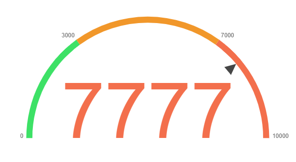

<div align="center">
    
</div>

# TSGauge

Extension for Chart.js that allows you to draw "Speedometer" graphs.

### Compatibility
Requires [Chart.js](https://github.com/chartjs/Chart.js/releases) **2.7.0** or later.

### Install
```html
<script src="Gauge.js"></script>
```

### Example:
```js
var ctx = document.getElementById("canvas").getContext("2d");
new Chart(ctx, {
	type: "tsgauge",
	data: {
		datasets: [{
			backgroundColor: ["#0fdc63", "#fd9704", "#ff7143"],
			borderWidth: 0,
			gaugeData: {
				value: 7777,
				valueColor: "#ff7143"
			},
			gaugeLimits: [0, 3000, 7000, 10000]
		}]
	},
	options: {
            events: [],
            showMarkers: true
	}
});
```
## License

TSGauge is available under the [MIT license](https://opensource.org/licenses/MIT).
